# Wave function table

 

# Probability Distribution

(set $a_0=1$)

## Radial Function($r^2 R(r)^2$) {#radial-functionr2-rr2 .unnumbered}

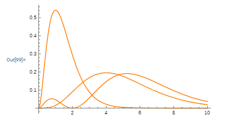{width="13cm"}

## Spherical Harmonic Function($Y(\theta,\phi)^2$) {#spherical-harmonic-functionythetaphi2 .unnumbered}

$\leftarrow$ less probability    high probability $\rightarrow$

  --------------------------------------- --------------------------------------- ---------------------------------------
   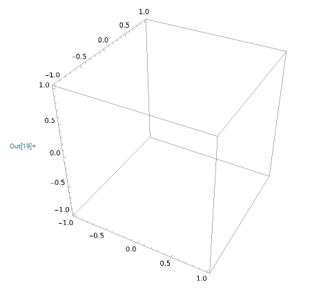{width="4.4cm"}   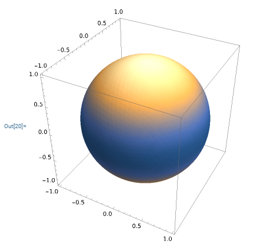{width="4.4cm"}   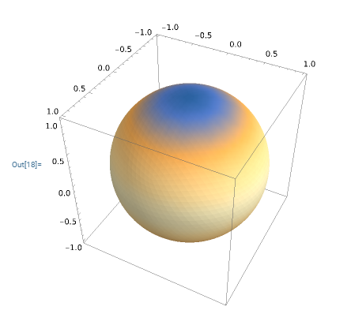{width="4.4cm"}
                $l=0, m=0$                              $l=1, m=0$                            $l=1, m=1, -1$
                                                                                  
   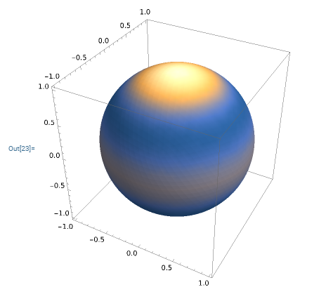{width="4.4cm"}   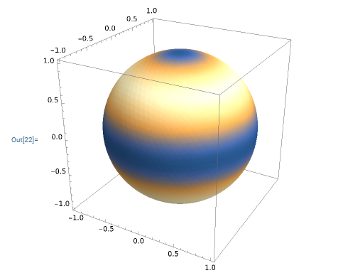{width="4.4cm"}   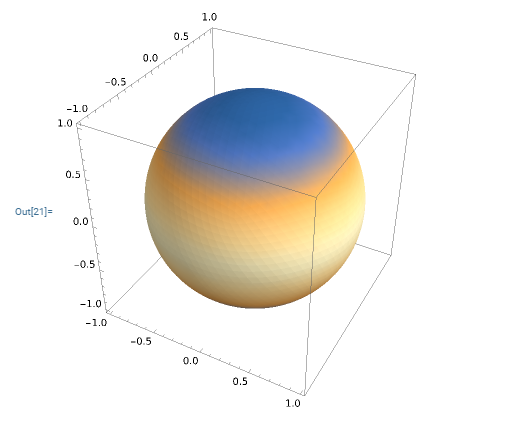{width="4.4cm"}
                $l=2, m=0$                            $l=2, m=1, -1$                          $l=2, m=2, -2$
  --------------------------------------- --------------------------------------- ---------------------------------------

  --------------------------------------- --------------------------------------- ---------------------------------------
   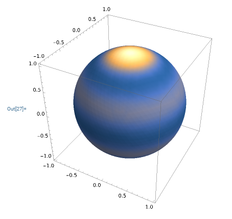{width="4.4cm"}   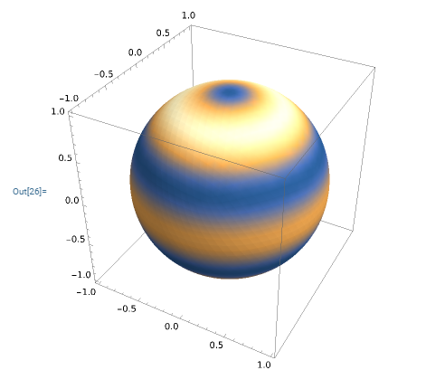{width="4.4cm"}   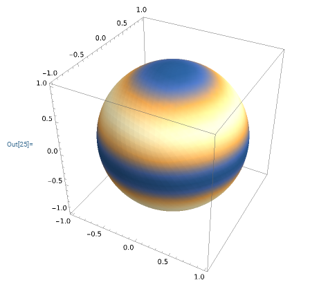{width="4.4cm"}
                $l=3, m=0$                            $l=3, m=1, -1$                          $l=3, m=2, -2$
                                                                                  
   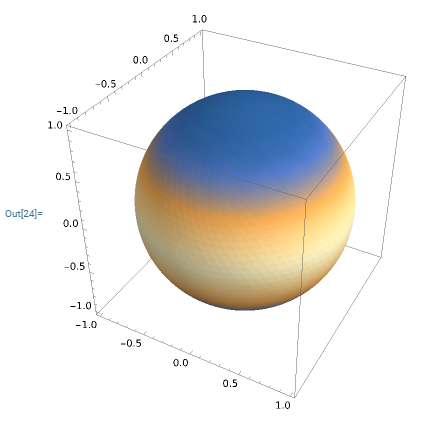{width="4.4cm"}                                          
              $l=3, m=3, -3$                                                      
  --------------------------------------- --------------------------------------- ---------------------------------------

  : Spherical Harmonics

## Wave Function($\psi(r,\theta,\phi)^2=R(r)^2Y(\theta,\phi)^2$) {#wave-functionpsirthetaphi2rr2ythetaphi2 .unnumbered}

$\leftarrow$ less probability    high probability $\rightarrow$

  -------------------------------------------- -------------------------------------------- --------------------------------------------
   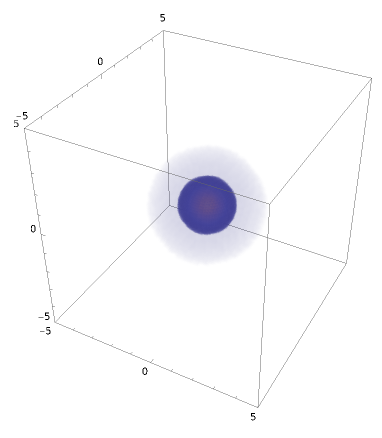{width="5cm"}   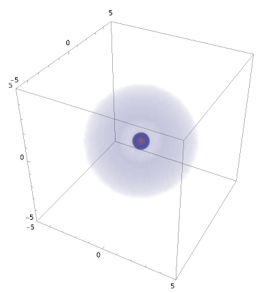{width="5cm"}   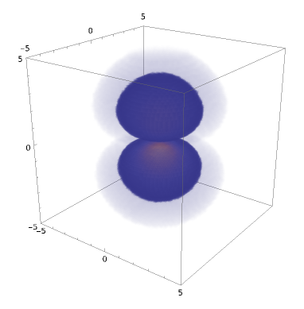{width="5cm"}
                $n=1, l=0, m=0$                              $n=2, l=0, m=0$                              $n=2, l=1, m=0$
                                                                                            
   {width="5cm"}                                               
              $n=2, l=1, m=1, -1$                                                           
  -------------------------------------------- -------------------------------------------- --------------------------------------------

  -------------------------------------------- -------------------------------------------- --------------------------------------------
   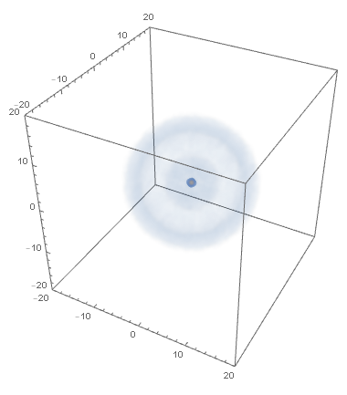{width="5cm"}   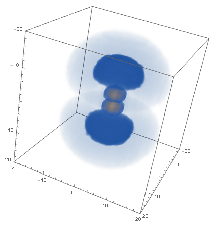{width="5cm"}   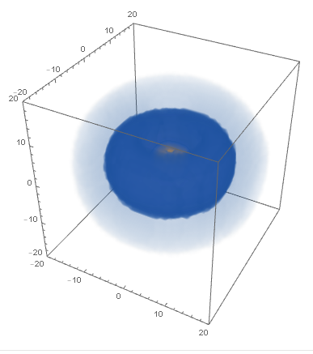{width="5cm"}
                $n=3, l=0, m=0$                              $n=3, l=1, m=0$                            $n=3, l=1, m=1, -1$
   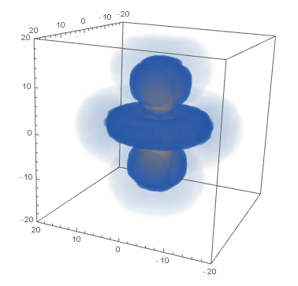{width="5cm"}   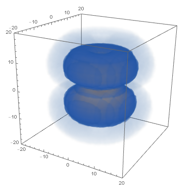{width="5cm"}   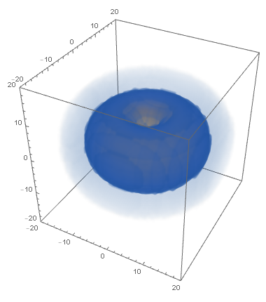{width="5cm"}
                $n=3, l=2, m=0$                            $n=3, l=2, m=1, -1$                          $n=3, l=2, m=2, -2$
  -------------------------------------------- -------------------------------------------- --------------------------------------------

  : Hydrogen Atom Orbitals

# MATHEMATICA Code

## DensityPlot3D {#densityplot3d .unnumbered}

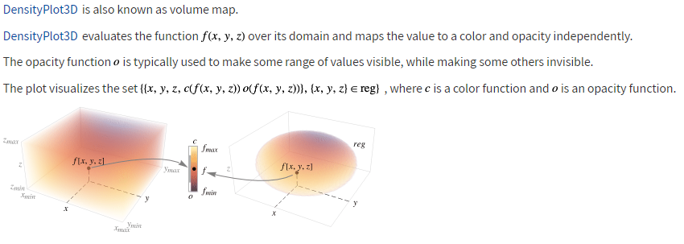{width="15cm"}

## Reference {#reference .unnumbered}

<https://reference.wolfram.com/language/ref/DensityPlot3D.html>
